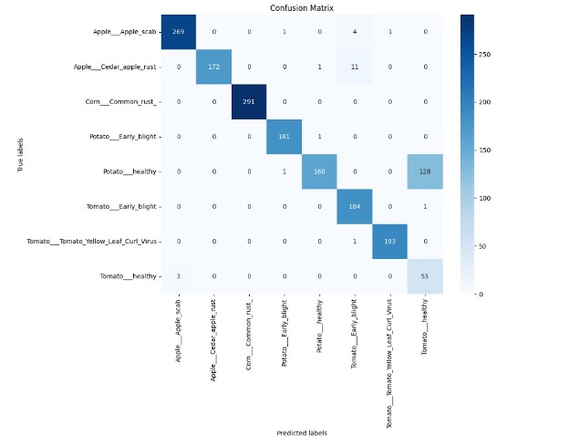
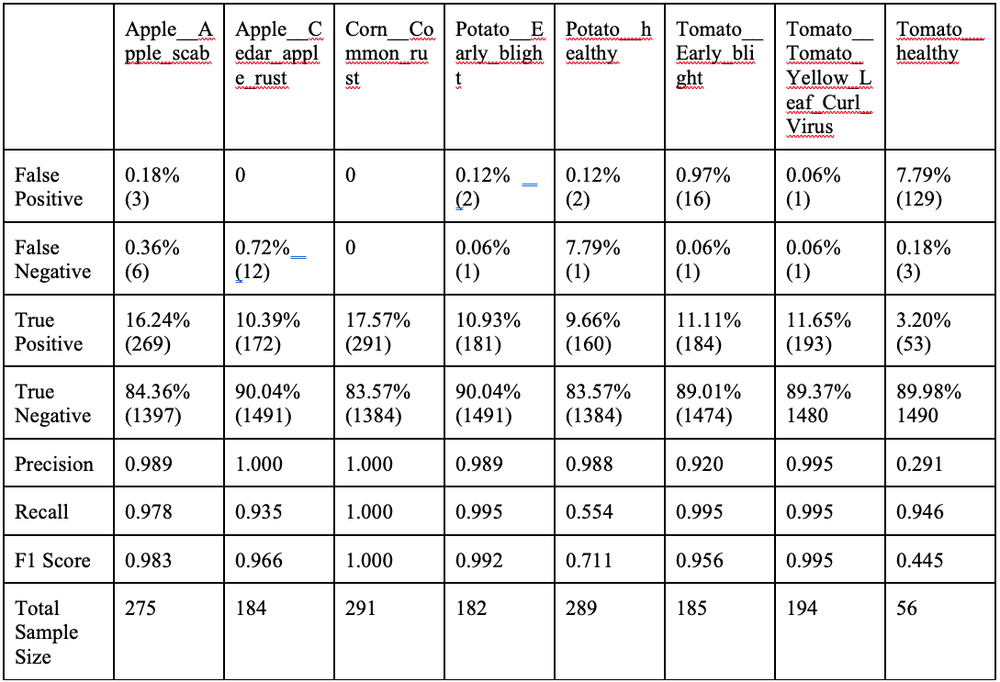

**Identifying Plant Diseases with Image Recognition**

By Ayan Saini

**Abstract**:

Worldwide, approximately 70-80% of plants suffer from some sort of plant
disease \[1\]. These diseases ravage through billions of dollars worth
of crops and thousands of tons of food, causing devastation to local
economies and increasing food insecurity throughout the globe. However,
the use of AI technology can help combat plant diseases by early
recognition of diseases through image recognition. This study employs a
convolutional neural network (CNN), implemented in Python, which is
trained on the "New Plant Disease Dataset," published on Kaggle, to
classify different plant diseases \[2\]. We used a subset of this
dataset across three folders. The training folder had \~16,000 images,
the validation folder had 3813 images and the testing folder had 1673
images. There were 8 unique labels on which the model was trained on.
The images are of healthy and infected leaves of these crops. The
trained model achieved an accuracy of 89.73% in testing but achieved
96.73% accuracy when tested against the validation folder in the
training process. Importantly, the classification was not a binary
prediction of healthy versus infected plants, but classified the
specific crop and specific type of disease. Interestingly, most of the
misclassification was between healthy versions of different crops, and
the model was even more powerful when considering just its ability to
predict diseases. This study highlights the potential use of CNNs in
automated disease detection. Thus, the use of AI methods can contribute
towards mitigation of agricultural losses and enhanced food security.

**Introduction:**

Plant diseases can pose a significant threat to global agricultural
infrastructure. Up to 80% of crops suffer from some sort of disease,
causing substantial economic loss and food insecurity worldwide \[1\].
In recent years, advancements in artificial intelligence, particularly
convolutional neural networks (CNNs), have shown promising results in
automated image recognition tasks \[3\]. This study attempts to employ
the use CNN models in the detection and classification of plant
diseases, aiming to reduce food insecurity and improve management
strategies.

The purpose of this project was to demonstrate the capabilities that CNN
models have and the benefits it can provide to society. Through image
recognition, crop disease identification will become easier, allowing
farmers to accurately diagnose their crops. The use of CNN models can
help to mitigate the economic and nutritional impacts of plant diseases,
thereby bolstering global food security efforts.

In conclusion, this study demonstrates the transformative impact of CNN
models in agriculture, highlighting their role in advancing
technological solutions to mitigate the economic and nutritional impacts
of plant diseases on a global scale.

**Dataset and Image Preprocessing:**

This project uses the "New Plant Disease Dataset" found on Kaggle by
user Samir Bhattarai who used offline augmentation to recreate it from
an original GitHub repo \[2\]. Due to the limitations of computational
resources, I used a subset of the full dataset including approximately
\~16,000 images in the training folder. The validation folder had 3813
images. The testing folder had 1673 images.

There are eight unique labels in each - 6 diseased and 2 healthy
classes: Apple\_\_\_Apple_scab, Corn\_\_\_Common_rust\_,
Potato\_\_\_Early_blight, Potato\_\_\_healthy, Tomato\_\_\_Early_blight,
Tomato\_\_\_healthy, Tomato\_\_\_Tomato_Yellow_Leaf_Curl_Virus, and
Apple\_\_\_Cedar_apple_rust. All together, the CNN model achieved an
accuracy of 89.73%, correctly predicting 1503 out of 1673 images.

Before feeding the images into the algorithm, a preparation step must
happen before doing so. To begin, the images must be loaded and resized
uniformly to 128x128 pixels as the images come in different sizes. Then,
the data must be split into an X and Y variable - this must be done for
both the training and validation folders. The data must be split in
order to distinguish the image from the label for the algorithm. The X
variable is the image (the input), while the Y variable is the label
(the output). During training, the model learns to map input data (X) to
the corresponding target labels (Y). Furthermore, the pixels of the
images are normalized in order for the model to converge quicker. Next,
the data augmentation is performed. Images are shifted, rotated, zoomed,
and flipped. This is so the model has more variation and a wider array
of data to learn from. The images are now ready to be fed into the
model.

**Methods and Models:**

For this particular project, a CNN model was used. CNNs are designed to
analyze and understand visual data. The model was coded entirely on
Python with Conda used as the virtual environment. The OS, NumPy,
Matplotlib, OpenCV, Sci-kit learn, and TensorFlow libraries were used.

**Model Parameters:** The model has three convolutional layers, the
first with 32 filters and a 3x3 kernel size, the second with 64 filters,
and third with 128 filters. In between each layer, a max pooling layer
function was used in order to obtain the maximum values of each layer's
feature map. This is to ensure any useless or unnecessary data isn't
used and slow down the process. Next, a flatten function was used in
order to turn the multidimensional output from the convolutional and
pooling layers into a 1D vector. This is crucial in order to transition
from the convolutional part of the network to the fully connected part.
After the data was flattened, a dense function was called in order to
finalize the classification that was extracted by the convolutional
layers. This function had 128 neurons. This layer connects every neuron
in the previous layer to every neuron in its layer. An activation
argument of "relu" was used due to its simplicity and effectiveness. The
ReLu activation function returns the input value if it is positive,
otherwise it returns zero - this helps in faster convergence during
training. In order to prevent overfitting due to the large amount of
data, a dropout function was called and tuned to a 50% dropout rate.
Another dense layer was formed with 128 neurons and was used as the
output layer. An activation of softmax was used since the project
required multiclass classification. The optimizer for the compilation
was "adam" and the loss function was Sparse Categorical Cross Entropy
(which is used for integer labels) because of a multiclass
classification requirement. The softmax argument converts raw output
scores into probability distributions, such that the model outputs
probabilities for each class. TensorFlow is used to train the model.
Using TensorFlow, a TensorBoard log and callback variable is set up in
order to save and log training metrics. The training used a batch size
of 32 and 20 epochs and took approximately one hour to complete.

**Results:**

Figure 1: Confusion Matrix for the Testing Data

Figure 1 shows a confusion matrix for the testing data. Out of 1675
testing samples, the model correctly predicted 1503 images. This is an
accuracy of 89.73%. However, the validation data had a higher accuracy
of 96.73% after the 20th epoch. This could be due to overfitting. As
seen above, the model particularly had trouble distinguishing between
healthy potato leaves and healthy tomato leaves. Out of 289 healthy
potato images, the model misidentified 128 images as healthy tomato
leaves. However, the model did exceptionally well on Corn Common Rust
disease, correctly predicting every image. Furthermore, the table below
shows the metrics for each class.

As seen in the table above, most classes have high precision and recall,
resulting in high F1 scores. Due to numerous misclassifications - mostly
from several false positives from misclassified Potato\_\_\_Healthy -
the Tomato\_\_\_Healthy class has a low precision and a high number of
false positives. This means that a significant number of instances
predicted as that class are actually from other classes. It is
over-predicting this class. On the contrary, the Potato\_\_\_Healthy
class has a good precision, but low recall, as it misidentifies healthy
potato leaves and misses them. Fundamentally, the model is accurately
predicting that the healthy leaves are not diseased. However, it
struggles with differentiating between healthy leaves of different
plants.

Averaging all the metrics, the overall performance of the model can be
determined. The average for precision is 0.895, meaning the model
usually is correct when predicting a positive class. The average for
recall is 0.924, meaning that the model correctly identifies actual
instances of each class, with a low rate of false negatives. With an
average F1 score of 0.881, the model has an overall balanced
performance, however there is room for improvement.

**Conclusion:**

Although not perfect, this study successfully demonstrates the potential
usage of CNN model in agricultural disease identification. By using the
"New Plant Disease Dataset" by Samir Bhattarai on Kaggle, the CNN model
achieved an 89.73% in predicting diseased crop images \[2\]. This result
highlights the efficacy of using CNN models in disease identification in
agriculture. The high precision and accuracy of the model underscores
the viability of AI in fields such as agriculture.

Due to limitations in computational resources, the size of the used
dataset had to be reduced, which may have impacted the model's
generalizability. Furthermore, misidentification of health plants
highlighted the need for further training with a larger number of health
crop classes and images. In spite of these limitations, this study
successfully demonstrates the potential use of CNN models in
agricultural disease identification. By using the "New Plant Disease
Dataset" by Samir Bhattarai on Kaggle, the CNN model achieved an
accuracy of 89.73% in predicting diseased crop images \[2\]. This result
highlights the efficacy of using CNN models in disease identification in
agriculture. The high precision and accuracy of the model underscores
the viability of AI in fields such as agriculture. Due to the model's
strong performance, the integration of this CNN model in plant disease
detection can provide farmers an effective tool to increase crop yield
and successfully identify crop diseases, reducing economic losses and
enhancing food security throughout the world.

**Future Work:** Further research and enhancements should focus on
broadening the dataset to include a multitude of plants and diseases.
With more images and data, this tool's generalizability can be
strengthened and can be used in the real world. Additionally, more
healthy leaf images should be added so the model can distinguish between
crops' healthy leaves. Specifically, more testing images should be
placed for the Tomato\_\_\_Healthy class. Due to the small amount of
images for this class, the overall score for that class may have been
skewed. Furthermore, exploring more advanced CNN techniques such as
transfer learning should be used to further improve this model.
Continued advancements in this field will transform the agricultural
field, bolstering food security and foster more secure agriculture
systems.

Work Cited

\[1\] Baleev, D., Ivanova, M., Karakozova, M., Nazarov, P., & Sokolova,
L. (2020). Infectious Plant Diseases: Etiology, Current Status, Problems
and Prospects in Plant Protection. *National Library of Medicine*,
12(3), 46-59. 10.32607/actanaturae.11026

\[2\] Hughes, D., & Salathé, M. (2015). An Open Access Repository of
Images on Plant Health to Enable the Development of Mobile Disease
Diagnostics. *arXiv,* arXiv:1511.08060, 1-13.
https://arxiv.org/pdf/1511.08060

\[3\] Liu, J., & Wang, X. (2021). Plant diseases and pests detection
based on deep learning: A review. Plant Methods, 17(1), 22.
https://doi.org/10.1186/s13007-021-00722-9

Link to code: https://github.com/revnav/ayansaini-cropclass/tree/master
